# Vizor Agents - AR Bridge Design System

An AI-assisted bridge design system that uses intelligent agents to control Rhino Grasshopper for parametric design generation. This system features multi-provider AI model support and integrates with the Model Context Protocol (MCP) via STDIO for collaborative, iterative geometry creation.

## Key Features

* **Multi-Provider AI Support**: Works with Gemini, OpenAI, Anthropic, DeepSeek, and HuggingFace.
* **Voice Input**: Hands-free design with wake word detection and speech recognition.
* **AR Integration**: Gaze tracking and spatial interaction with HoloLens.
* **Collaborative Design**: Supports iterative, conversational design workflows.
* **AI-Generated Geometry**: Capable of creating spirals, bridges, and other complex structures.
* **Stable Core Tools**: Optimized with 6 core MCP tools for reliable operation.
* **Cross-Platform Support**: Compatible with both native Windows and WSL2.
* **Conversation Memory**: Agents remember context between interactions for seamless sessions.
* **Natural Language Modifications**: Understands commands like "make it wider."
* **Dynamic Tool Discovery**: Can list available MCP tools upon request.
* **Interactive CLI**: User-friendly command-line interface with real-time status updates.

## Quick Start

### Prerequisites

* Windows 10/11 (WSL2 optional)
* Rhino 8 with Grasshopper
* Python 3.10+
* [UV package manager](https://docs.astral.sh/uv/install/)

### 1. Installation

Clone the repository and set up the environment.

**PowerShell (Windows):**
```powershell
# Install UV if needed
powershell -c "irm https://astral.sh/uv/install.ps1 | iex"

# Clone and set up the project
git clone https://github.com/Samulko/DF2025_Vizor_agents.git
cd DF2025_Vizor_agents
uv sync
```

**Bash (WSL2/Linux):**
```bash
# Clone and set up the project
git clone https://github.com/Samulko/DF2025_Vizor_agents.git
cd DF2025_Vizor_agents
uv sync
```

### 2. API Configuration

Copy the example environment file and add your API keys.

```bash
# For Windows
copy .env.example .env
notepad .env

# For WSL2/Linux
cp .env.example .env
nano .env
```

### 3. Grasshopper Setup

* **Pre-built**: Copy `GH_MCP.gha` to `%APPDATA%\Grasshopper\Libraries\`.
* **For Developers**: Open the solution in Visual Studio 2022 and run in debug mode with the `.stp` file.

After setup, restart Grasshopper, add the "Grasshopper MCP" component to the canvas, and configure it with **Enabled=True**, **Port=8081**, and **Address=0.0.0.0**.

### 4. Usage

#### Standard Mode (Keyboard Input)
To start a design session with keyboard input:
```bash
uv run python -m bridge_design_system.main
```

#### ROS-Free Mode
To run without ROS dependencies (disables gaze tracking):
```bash
uv run python -m bridge_design_system.main --disable-gaze
```

#### Voice Input Mode
For hands-free operation with voice commands:
```bash
# Install voice dependencies
uv sync --extra voice

# Run with voice input
uv run --extra voice python -m bridge_design_system.main --voice-input
```

**Voice Setup Requirements:**
1. Get a [Picovoice access key](https://console.picovoice.ai/)
2. Add voice configuration to your `.env` file:
   ```
   ACCESS_KEY=your_picovoice_key_here
   OPENAI_API_KEY=your_openai_key_here
   WAKE_WORD_MODEL_PATH=src/bridge_design_system/whisper-voice-assistant/models/hello-mave_en_linux_v3_0_0.ppn
   USE_OPENAI_API=true
   ```

**Voice Commands:**
- Say "Hello Mave" (wake word) to start voice input
- Speak your design command naturally
- Examples: "Hello Mave" → "Create a spiral staircase with 10 steps"
- All system commands work: "status", "reset", "exit", etc.

You can use natural language to create designs in both modes.

#### LCARS Agent Monitoring Interface

The system includes a Star Trek LCARS-styled real-time monitoring interface to track agent status and activities.

**Start monitoring interface:**
```bash
# Option 1: Start monitoring with the main system
uv run python -m bridge_design_system.main 

# Option 2: Start monitoring interface separately
uv run python -m bridge_design_system.monitoring.lcars_interface
```

**Access the interface:**
- Open your browser to http://localhost:5000
- View real-time agent status (Triage, Geometry, SysLogic agents)
- Monitor task history and tool usage
- LCARS-styled interface with Star Trek theming

**Features:**
- Real-time WebSocket updates
- Agent status indicators (STANDBY, PROCESSING, ACTIVE, etc.)
- Task completion history with expandable details
- Network accessible (viewable from any device on local network)
- Automatic reconnection and heartbeat monitoring

## Chat Agent Launcher

The system includes a flexible chat agent launcher supporting multiple modes for bridge design interaction:

### Usage

```bash
python launch_voice_agent.py [mode]
```

| Mode       | Description                                             | Dependencies                                 |
|------------|---------------------------------------------------------|----------------------------------------------|
| voice      | Voice chat with Gemini Live API (default)               | `uv add google-genai fastrtc`                |
| text       | Text-based chat interface (no voice deps)               | None                                         |
| multimodal | Voice + Video + Image chat (full multimodal interface)  | `uv add google-genai fastrtc gradio pillow`  |

#### Examples

```bash
python launch_voice_agent.py              # Voice mode (default)
python launch_voice_agent.py voice        # Voice mode
python launch_voice_agent.py text         # Text mode
python launch_voice_agent.py multimodal   # Multimodal mode
python launch_voice_agent.py --help       # Show help
```

#### Environment
- `GEMINI_API_KEY=your_api_key_here` (required for voice/multimodal)

#### Text Chat Commands
- `design <task>`: Send a design task to the supervisor (e.g., `design create a cable stayed bridge`)
- `status`: Get system/agent status
- `reset`: Reset the design session/agent memory
- `help`: Show help
- `exit`: Exit the chat

## Architecture Overview

The system operates through the following flow:

```
WSL/Windows Environment -> MCP via STDIO -> STDIO MCP Server -> TCP Bridge (Port 8081) -> Grasshopper MCP Component -> Real-time Geometry Creation
```

### Multi-Agent System
* **Triage Agent**: Orchestrates design workflows.
* **Geometry Agent**: Controls Grasshopper for 3D modeling.
* **SysLogic**: Manages construction material data, validity of the strucutre that is being designed and handles post-rationalization process.

### System Sequence Diagram

The following diagram shows the detailed interaction flow between system components:

```mermaid
sequenceDiagram
    participant U as User
    participant WW as Wake Word<br/>(Porcupine)
    participant VI as Voice Input<br/>(Whisper)
    participant BCA as Bridge Chat Agent<br/>(Gemini Live)
    participant MAIN as Main System<br/>(main.py)
    participant TA as Triage Agent<br/>(Coordinator)
    participant BDS as Bridge Design<br/>Supervisor
    participant GA as Geometry Agent<br/>(MCP-enabled)
    participant RA as Rational Agent<br/>(Structural)
    participant MCP as MCP Bridge<br/>(MCPAdapt)
    participant GH as Grasshopper<br/>(C# Component)
    participant AM as Agent Monitor<br/>(Callbacks)
    participant WS as WebSocket Server<br/>(Status)
    participant LCARS as LCARS Monitor<br/>(UI)

    Note over U,LCARS: System Initialization
    U->>MAIN: Start system (interactive_mode)
    activate MAIN
    MAIN->>MAIN: validate_environment()
    Note right of MAIN: Check API keys:<br/>OpenAI, Anthropic, Gemini
    MAIN->>AM: create_agent_monitor_system()
    activate AM
    AM->>WS: Initialize WebSocket broadcaster
    activate WS
    AM->>LCARS: start_monitoring_server()
    activate LCARS
    
    MAIN->>TA: create_triage_system()
    activate TA
    TA->>GA: create_mcp_enabled_geometry_agent()
    activate GA
    GA->>MCP: MCPAdapt(stdio_params)
    activate MCP
    MCP->>GH: Start C# MCP component
    activate GH
    GH-->>MCP: Available tools: create_component,<br/>connect_components, get_document_info
    MCP-->>GA: 15+ MCP tools integrated
    GA->>AM: Register monitoring callback
    
    TA->>RA: create_rational_agent()
    activate RA
    RA->>AM: Register monitoring callback
    
    TA->>BDS: create_bridge_design_supervisor()
    activate BDS
    BDS->>AM: Register supervisor monitoring

    Note over U,LCARS: Voice Interaction Flow
    U->>WW: Ambient audio monitoring
    activate WW
    WW->>WW: pvporcupine.detect("Hey Vizor")
    WW->>VI: Wake word detected!
    activate VI
    VI->>U: "[MIC] Listening..."
    
    U->>VI: "Create a cable-stayed bridge"
    VI->>VI: Whisper transcription
    alt Voice Chat Mode (Gemini Live)
        VI->>BCA: Transcribed text
        activate BCA
        BCA->>BCA: Initialize Gemini Live session
        BCA->>AM: Register chat agent monitoring
        U->>BCA: Voice input (real-time stream)
        BCA->>BCA: Process with Gemini Live API
        alt Complex Bridge Design Task
            BCA->>BDS: Tool call: design_bridge_component(task)
            BDS->>AM: Update status: "coordinating"
            BDS->>GA: Delegate geometry creation
            BDS->>RA: Request structural validation
            BDS-->>BCA: Structured design results
            BCA->>U: Voice response (synthesized)
        else Simple Engineering Question
            BCA->>BCA: Direct response from Gemini
            BCA->>U: Voice response
        end
        deactivate BCA
    else Text/CLI Mode
        VI->>MAIN: Transcribed text
        MAIN->>TA: handle_design_request(request)
    end
    deactivate VI
    deactivate WW

    Note over U,LCARS: Triage and Delegation Flow
    TA->>TA: Analyze request type using LLM
    TA->>AM: Update status: "analyzing"
    
    alt Simple Geometry Task
        TA->>GA: Delegate to geometry agent
        GA->>AM: Update status: "mcp_connecting"
        GA->>MCP: create_component(type="beam")
        MCP->>GH: ComponentCommandHandler.CreateComponent()
        GH->>GH: Generate Grasshopper component
        GH-->>MCP: Component GUID + properties
        MCP-->>GA: Tool execution result
        GA->>GA: Update memory with design state
        GA->>AM: Update status: "completed"
        GA-->>TA: Geometry creation results
    else Structural Analysis Task
        TA->>RA: Delegate to rational agent
        RA->>AM: Update status: "calculating"
        RA->>RA: Load structural formulas
        RA->>RA: Apply safety factors
        RA->>AM: Update status: "completed"
        RA-->>TA: Analysis results with recommendations
    else Complex Bridge Design (Multi-Agent)
        TA->>BDS: Coordinate multi-agent task
        BDS->>AM: Update status: "coordinating"
        BDS->>GA: Create bridge structure
        GA->>MCP: Multiple MCP tool calls
        MCP->>GH: Create towers, cables, deck
        GH-->>MCP: Bridge geometry data
        BDS->>RA: Validate structural integrity
        RA->>RA: Calculate load paths
        BDS->>BDS: Coordinate design iterations
        BDS-->>TA: Complete bridge design package
    end
    
    TA->>AM: Update status: "task_routing_complete"
    TA-->>MAIN: Task results with metadata

    Note over U,LCARS: Real-time Monitoring Flow
    loop Continuous Agent Monitoring
        GA->>AM: MonitorCallback(memory_step, agent)
        RA->>AM: Step callback with analysis data
        TA->>AM: Coordination status updates
        BDS->>AM: Supervisor coordination events
        AM->>WS: Broadcast agent status
        WS->>LCARS: Real-time status updates
        LCARS->>U: Live dashboard (localhost:5000)
    end

    Note over U,LCARS: Error Handling and Recovery
    alt MCP Connection Error
        GA->>MCP: create_component() call
        MCP-xGH: Connection timeout/failure
        MCP-->>GA: ConnectionError exception
        GA->>AM: Update status: "mcp_error"
        AM->>WS: Broadcast error status
        WS->>LCARS: Red alert indicators
        LCARS->>U: "[WARNING] MCP Connection Lost"
        GA->>GA: Attempt reconnection (3 retries)
        alt Reconnection Successful
            GA->>MCP: Re-establish connection
            GA->>AM: Update status: "mcp_reconnected"
        else Reconnection Failed
            GA-->>TA: "MCP unavailable, geometric operations disabled"
            TA->>RA: "Continue with structural analysis only"
        end
    else Agent Execution Error
        TA->>GA: Complex geometry task
        GA-xGA: Tool execution exception
        GA->>AM: Queue error update
        AM->>WS: Broadcast error status
        TA->>TA: Analyze error type
        alt Recoverable Error
            TA->>GA: Retry with simplified parameters
        else Non-recoverable Error
            TA->>BDS: Escalate to supervisor
            BDS->>RA: Alternative structural approach
        end
    end

    Note over U,LCARS: Session Reset
    U->>MAIN: Reset request
    MAIN->>AM: Broadcast reset notification
    AM->>WS: Notify all connected clients
    WS->>LCARS: Display reset progress
    LCARS->>U: "[RESET] Resetting system state..."
    MAIN->>TA: reset_all_agents()
    TA->>GA: Clear geometry agent memory
    TA->>RA: Clear structural agent memory
    TA->>BDS: reset_design_session()
    TA-->>MAIN: "All agents reset successfully"
    LCARS->>U: "[SUCCESS] System reset complete"

    Note over U,LCARS: System Shutdown
    U->>MAIN: Shutdown signal (Ctrl+C)
    MAIN->>AM: Broadcast shutdown notification
    AM->>WS: Notify all clients of pending shutdown
    WS->>LCARS: Display shutdown countdown
    LCARS->>U: "[WARNING] System shutting down..."
    MAIN->>TA: Cleanup and finalize agents
    TA->>GA: Graceful geometry agent shutdown
    GA->>MCP: Close MCP connection gracefully
    MCP->>GH: Send termination signal
    GH->>GH: Save current document state
    deactivate GH
    deactivate MCP
    deactivate GA
    deactivate RA
    deactivate BDS
    deactivate TA
    MAIN->>WS: Stop WebSocket server
    deactivate WS
    MAIN->>LCARS: Stop LCARS interface
    deactivate LCARS
    deactivate AM
    MAIN->>U: "[SUCCESS] Bridge Design System shutdown complete"
    deactivate MAIN
```



This diagram illustrates the complete system workflow from initialization through voice interaction, agent coordination, real-time monitoring, error handling, and graceful shutdown. The system's modular architecture allows for robust multi-agent collaboration with comprehensive error recovery and real-time status monitoring.

## Available Tools

The system is optimized with 6 core MCP tools for stability:

* `add_python3_script`
* `get_python3_script`
* `edit_python3_script`
* `get_python3_script_errors`
* `get_component_info_enhanced`
* `get_all_components_enhanced`

The limited toolset ensures reliable operation, with the Python script tool offering extensive flexibility for geometry creation.

## Development

### Project Structure
```
DF2025_Vizor_agents/
├── src/bridge_design_system/
│   ├── agents/           # Agent implementations
│   ├── config/           # Settings and configuration  
│   ├── tools/            # Agent tools
│   ├── mcp/              # MCP integration
│   │   └── GH_MCP/       # C# Grasshopper component
│   └── main.py           # Entry point
├── system_prompts/       # Agent system prompts
├── tutorials/            # Workshop tutorials
└── pyproject.toml        # Project configuration
```

### Development Commands

```bash
# Format code
uv run black src/

# Lint code  
uv run ruff check src/

# Run the system
uv run python -m bridge_design_system.main
```

```
This is meant to be run in WSL

# Run this in terminal 1

uv run python -m bridge_design_system.main --interactive --enable-command-server --disable-gaze

# Run this in terminal 2

uv run python -m bridge_design_system.agents.chat_voice voice
```

## License

This project is licensed under the MIT License. See the `LICENSE` file for details.


